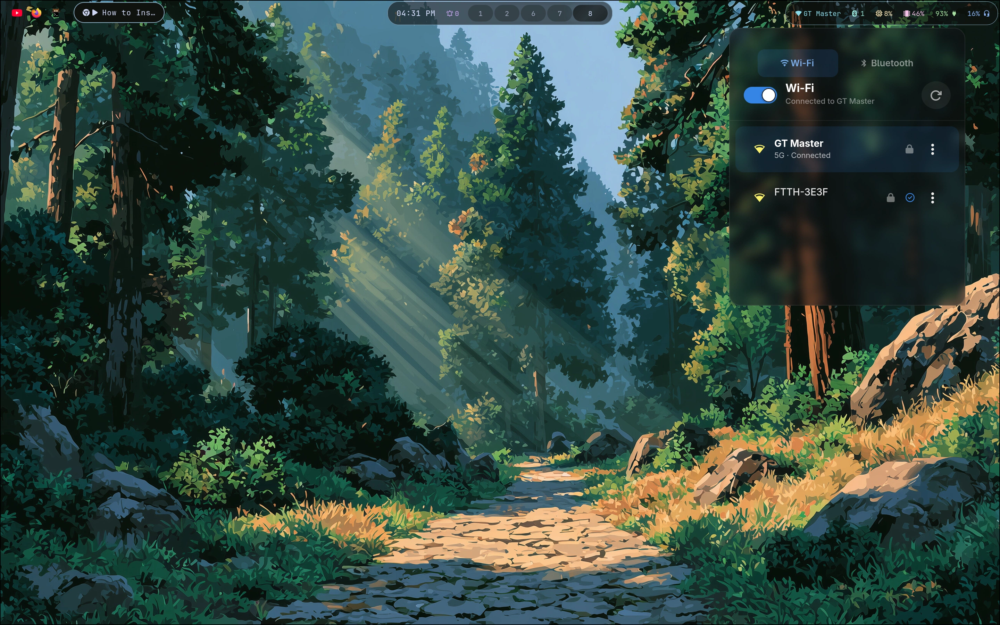

# wifi-manager

A lightweight, native WiFi and Bluetooth manager for Wayland compositors. Built with Rust, GTK4, and layer-shell — designed as a proper alternative to `nmtui`, `nm-applet`, `blueman`, and rofi-based scripts.

> **Status:** wifi-manager is under active development. Interfaces and configuration may change between releases.

<p align="center">
  
  
</p>

## Table of Contents

- [Why](#why)
- [Features](#features)
- [Installation](#installation)
  - [Arch Linux (AUR)](#arch-linux-aur)
  - [Nix](#nix)
  - [Other Distributions (Build from Source)](#other-distributions-build-from-source)
- [Usage](#usage)
  - [Hyprland Integration](#hyprland-integration)
- [Configuration](#configuration)
- [Theming](#theming)
- [Architecture](#architecture)
- [Tech Stack](#tech-stack)
- [License](#license)

## Why

There is no widely adopted standalone GUI WiFi manager designed specifically for Wayland compositors:

| Existing tool          | Problem                                                          |
| ---------------------- | ---------------------------------------------------------------- |
| `nm-applet`            | Tray-based, scan/connect dropdown broken on Wayland              |
| `nm-connection-editor` | Only edits saved connections, no scanning                        |
| `nmtui`                | Terminal TUI, not a GUI                                          |
| `iwgtk`                | Requires iwd, most distros use NetworkManager                    |
| Rofi/wofi scripts      | No real UI — no signal bars, no live updates, no visual feedback |

**wifi-manager** fills this gap: a floating panel that manages WiFi and Bluetooth with a proper GUI, live state updates, and full theming support.

## Features

### WiFi

- **Scan and list** available WiFi networks with signal strength, frequency band, and security info
- **Connect** to open, WPA2, and WPA3 networks with inline password entry
- **Saved network detection** — reconnects to known networks without re-entering passwords
- **Live updates** — UI reflects WiFi state changes in real time (D-Bus signal subscriptions)
- **Scan-on-show** — automatically rescans when the panel is toggled visible
- **WiFi toggle** — enable/disable the wireless radio directly from the panel
- **Forget network** — remove saved connections via the ⋮ menu on each network

### Bluetooth

- **Device discovery** — scan for nearby Bluetooth devices
- **Connect/disconnect** — manage paired and new devices
- **Pairing** — "Just Works" pairing with auto-trust for new devices
- **Power toggle** — enable/disable the Bluetooth adapter
- **Live updates** — device list refreshes automatically via BlueZ D-Bus signals
- **Device categories** — icons for audio, phone, computer, input, and other device types
- **Remove device** — unpair devices via the ⋮ menu
- **Graceful fallback** — BT tab is hidden if no Bluetooth adapter is detected

### General

- **Brightness & Volume Controls** — dedicated sliders statically pinned to the bottom of the panel,
  syncing in real-time with system events via `libpulse` and `systemd-logind`
- **Night Mode (Color Temperature)** — dedicated slider to adjust display warmth,
  powered by Wayland's `wlr-gamma-control` protocol
- **Tabbed interface** — switch between WiFi and Bluetooth tabs
- **Context-aware toggle** — single switch controls WiFi or Bluetooth power based on active tab
- **Daemon mode** — runs as a background process, toggled via CLI flag or D-Bus
- **Layer-shell overlay** — floating panel with no window decorations, positioned via config
- **Configurable position** — 9 anchor positions with per-edge margin offsets
- **Custom CSS theming** — override the default dark theme with your own styles
- **Customizable signal icons** — configure signal strength icons via config
- **Forget network** — remove saved connections via the ⋮ menu on each network
- **Live reload** — reload config and CSS without restarting (`--reload`)
- **Escape to close** — press Escape to hide the panel

## Installation

### Arch Linux (AUR)

**Package:** `wifi-manager-git` — tracks the latest development version from the `master` branch.

```sh
yay -S wifi-manager-git
# or
paru -S wifi-manager-git
```

> **Note:** A stable release package (`wifi-manager`) will be available once v1.0.0 is tagged.

### Runtime Dependencies

The following must be installed and running on your system:

- **NetworkManager** — system network service
- **BlueZ** — Bluetooth protocol stack (optional — BT tab is hidden if unavailable)
- **PulseAudio / PipeWire-Pulse** — Audio server for volume control integration
- **systemd-logind** — Session manager for brightness control (standard on systemd distros)
- **GTK4** — UI toolkit
- **gtk4-layer-shell** — Wayland layer-shell integration

These are automatically installed as dependencies when using the AUR package.

### Nix

If you have Nix installed with flakes enabled, you can interact with `wifi-manager` without manually installing any system dependencies.

**Run immediately without installing:**

```bash
nix run github:Vijay-papanaboina/wifi-manager
```

**Install permanently:**

```bash
nix profile install github:Vijay-papanaboina/wifi-manager
```

**Clone and Build:**

```sh
git clone https://github.com/Vijay-papanaboina/wifi-manager.git
cd wifi-manager
nix build
./result/bin/wifi-manager
```

**Development Shell:**

```sh
nix develop
# This opens a shell with all required libs (GTK4, etc.) and Rust tools.
cargo run
```

### Other Distributions (Build from Source)

**Requirements:**

- Linux with Wayland (Hyprland, Sway, or any wlroots-based compositor)
- [NetworkManager](https://networkmanager.dev/) as the system network service
- [BlueZ](http://www.bluez.org/) for Bluetooth support (optional)
- GTK4 and gtk4-layer-shell libraries
- Rust toolchain (1.85+)

**System Dependencies:**

**Arch Linux:**

```sh
sudo pacman -S gtk4 gtk4-layer-shell networkmanager bluez rust libpulse
```

**Fedora:**

```sh
sudo dnf install gtk4-devel gtk4-layer-shell-devel NetworkManager bluez rust cargo pulseaudio-libs-devel
```

**Ubuntu/Debian:**

```sh
sudo apt install libgtk-4-dev libgtk4-layer-shell-dev network-manager bluez cargo libpulse-dev
```

**Build:**

```sh
git clone https://github.com/Vijay-papanaboina/wifi-manager.git
cd wifi-manager
cargo build --release
sudo install -Dm755 target/release/wifi-manager /usr/local/bin/wifi-manager
```

## Usage

```sh
# Launch the daemon (panel starts hidden, then shown on first load)
wifi-manager

# Toggle panel visibility
wifi-manager --toggle

# Reload config and CSS without restarting
wifi-manager --reload
```

### Hyprland Integration

Add to your Hyprland config:

```ini
# Autostart and keybind
exec-once = wifi-manager
bind = $mainMod, W, exec, wifi-manager --toggle

# Optional: blur and styling for the panel
layerrule = blur on, match:namespace wifi-manager
layerrule = ignore_alpha 0.3, match:namespace wifi-manager
```

The layer namespace is `wifi-manager` (visible in `hyprctl layers`). You can target it with any Hyprland `layerrule` — blur, shadows, animations, etc.

## Configuration

Configuration is loaded from `~/.config/wifi-manager/config.toml`. All fields are optional and fall back to defaults.

```toml
# Window position on screen.
# Options: center, top-right, top-center, top-left,
#          bottom-right, bottom-center, bottom-left,
#          center-right, center-left
position = "center"

# Margin offsets in pixels (only effective on anchored edges).
margin_top = 10
margin_right = 10
margin_bottom = 10
margin_left = 10

# Custom signal strength icons [weak, fair, good, strong]
# Default: Nerd Fonts WiFi icons
signal_icons = ["󰤟", "󰤢", "󰤥", "󰤨"]

# Alternative examples:
# signal_icons = ["▂___", "▂▄__", "▂▄▆_", "▂▄▆█"]
```

> **Note:** Margins only apply to edges the window is anchored to. For example, with `top-left`, only `margin_top` and `margin_left` have an effect. With `center`, no margins apply.

**Signal Icon Ranges:**

- `signal_icons[0]` (weak): 0-24% signal strength
- `signal_icons[1]` (fair): 25-49% signal strength
- `signal_icons[2]` (good): 50-74% signal strength
- `signal_icons[3]` (strong): 75-100% signal strength

## Theming

wifi-manager ships with a dark default theme. To customize, create:

```
~/.config/wifi-manager/style.css
```

Your CSS overrides the default theme. Available selectors:

| Selector                 | Element                        |
| ------------------------ | ------------------------------ |
| `.wifi-panel`            | Main window container          |
| `.header`                | Top bar (toggle, status, scan) |
| `.tab-bar`               | Tab container                  |
| `.tab-button`            | Wi-Fi / Bluetooth tab button   |
| `.network-list`          | Scrollable network list        |
| `.network-row`           | Individual network entry       |
| `.network-row.connected` | Connected network              |
| `.network-row.saved`     | Known/saved network            |
| `.ssid-label`            | Network name                   |
| `.signal-icon`           | Signal strength indicator      |
| `.security-icon`         | Lock/open icon                 |
| `.device-list`           | Bluetooth device list          |
| `.device-row`            | Individual Bluetooth device    |
| `.device-row.connected`  | Connected Bluetooth device     |
| `.device-name`           | Bluetooth device name          |
| `.device-icon`           | Device category icon           |
| `.trusted-icon`          | Trusted device indicator       |
| `.password-entry`        | Password input field           |
| `.connect-button`        | Connect action button          |
| `.error-label`           | Error messages                 |

## Architecture

```
src/
├── main.rs                  # Entry point, CLI parsing, GTK application setup
├── config.rs                # Configuration loader (TOML)
├── daemon.rs                # D-Bus daemon service (Toggle/Show/Hide)
├── app/
│   ├── mod.rs               # App state and setup (WiFi + Bluetooth)
│   ├── scanning.rs          # WiFi scan logic and polling
│   ├── connection.rs        # WiFi toggle, network click, password actions
│   ├── live_updates.rs      # WiFi D-Bus signal subscriptions
│   ├── bluetooth.rs         # Bluetooth controller (scan, connect, power)
│   ├── bt_live_updates.rs   # Bluetooth D-Bus signal subscriptions
│   ├── controls.rs          # Wires GTK controls UI to backend managers
│   └── shortcuts.rs         # Keyboard shortcuts and hot-reload
├── controls/
│   ├── mod.rs               # Entry point for backend controls
│   ├── brightness.rs        # BrightnessManager (systemd-logind + sysfs)
│   ├── volume.rs            # VolumeManager (libpulse-binding)
│   └── night_mode.rs        # NightModeManager (Wayland wlr-gamma-control)
├── dbus/
│   ├── proxies.rs           # NetworkManager D-Bus proxy traits (zbus)
│   ├── network_manager.rs   # High-level WiFi operations
│   ├── access_point.rs      # WiFi data model (Network, SecurityType, Band)
│   ├── connection.rs        # NM connection settings builders
│   ├── bluez_proxies.rs     # BlueZ D-Bus proxy traits (Adapter1, Device1)
│   ├── bluetooth_manager.rs # High-level Bluetooth operations
│   └── bluetooth_device.rs  # Bluetooth data model (BluetoothDevice, DeviceCategory)
└── ui/
    ├── window.rs            # Layer-shell window setup, tab stack
    ├── header.rs            # Header bar with tab switcher
    ├── controls_panel.rs    # Brightness and Volume sliders (footer)
    ├── network_list.rs      # WiFi network list
    ├── network_row.rs       # WiFi network row widget
    ├── device_list.rs       # Bluetooth device list
    ├── device_row.rs        # Bluetooth device row widget
    └── password_dialog.rs   # Inline password entry
```

## Tech Stack

| Component           | Library                                 |
| ------------------- | --------------------------------------- |
| Language            | Rust                                    |
| UI framework        | GTK4                                    |
| Wayland integration | gtk4-layer-shell / wayland-client       |
| D-Bus client        | zbus (pure Rust, async-io backend)      |
| WiFi backend        | NetworkManager (D-Bus)                  |
| Bluetooth backend   | BlueZ (D-Bus)                           |
| Audio backend       | libpulse (PulseAudio or PipeWire-Pulse) |
| Brightness backend  | systemd-logind (D-Bus via zbus)         |
| Night Mode backend  | wlr-gamma-control (Wayland)             |
| Configuration       | serde + toml                            |
| CLI                 | clap                                    |

## License

MIT
